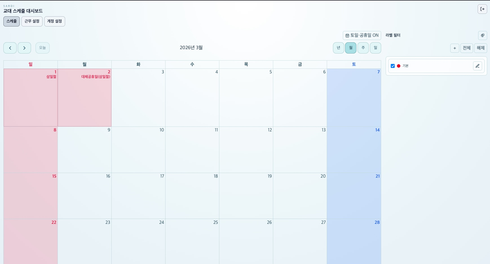
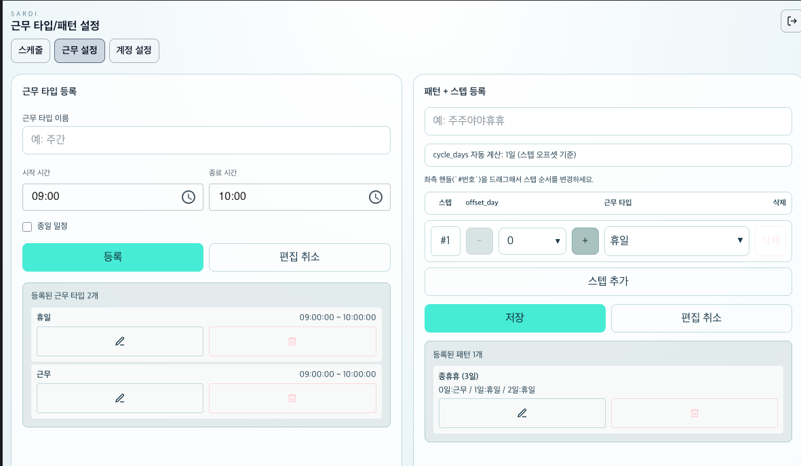
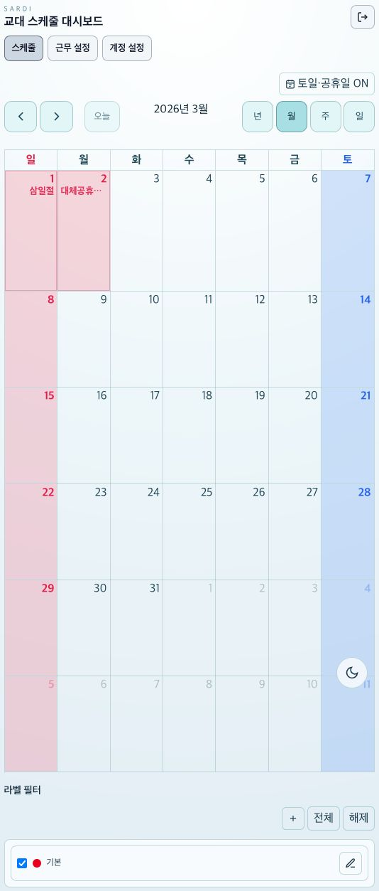

# SARDI

개인 계정 기준의 근무 스케줄 관리 웹앱입니다. 현재 메인 UX는 직원/근무 형태/반복 패턴/회사 이벤트를 조합해 보는 근무표 대시보드입니다.





## 핵심 기능

- 근무 스케줄 대시보드 (`일 / 주 / 월`)
- 근무 형태 CRUD
- 반복 패턴 CRUD 및 근무 형태 조합형 패턴 편집
- 직원 CRUD + 표시 순서 DnD
- 직원별 패턴 배정 기간 관리
- 직원별 날짜 오버라이드(스케줄 변경)
- 회사 이벤트 CRUD + 반복 간격/횟수 관리
- 패스키(WebAuthn) 관리 + 계정 비밀번호 변경
- 라이트/다크 테마 전환 및 새로고침 후 유지

## 기술 스택

- Next.js 16 (App Router)
- React 19 + TypeScript
- Tailwind CSS v4
- Next Route Handler 프록시 (`/api/sardi`, `/api/auth`, `/api/webauthn`)
- WebAuthn 브라우저 API

참고:


## 환경 변수

```env
# 빌드타임(Next rewrites 전용)
BUILD_SARDI_BACKEND_URL=http://127.0.0.1:8080

# 런타임(Route Handler 프록시 전용)
SARDI_BACKEND_URL=http://127.0.0.1:8080
```

- `BUILD_SARDI_BACKEND_URL`
  - 사용 위치: `next.config.ts` rewrites
  - 반영 시점: **빌드 타임**
  - 주의: 이미지 빌드 시 값이 고정되므로, 운영에서는 반드시 빌드 단계에 주입해야 합니다.
- `SARDI_BACKEND_URL`
  - 사용 위치: `app/api/**` Route Handler 프록시 (`makeBackendUrl`)
  - 반영 시점: **런타임**

## 실행

```bash
npm install
npm run dev
```

검증:

```bash
npm run lint
npm run build
```

## Docker

이미지 빌드는 `docker/Dockerfile` 기준입니다.

```bash
docker build \
  -f docker/Dockerfile \
  --build-arg BUILD_SARDI_BACKEND_URL=http://host.docker.internal:8080 \
  -t sardi:local .

docker run --rm -p 3000:3000 -e SARDI_BACKEND_URL=http://host.docker.internal:8080 sardi:local
```

## GitHub Actions (Tag Trigger)

- 워크플로: `.github/workflows/docker-build.yml`
- 트리거: 브랜치 `release/*`가 아니라 **Git Tag push** 기반
  - 예: `v0.1.0` 또는 `0.1.0`
- 동작:
  1. 태그에서 버전 추출
  2. 멀티아키(amd64/arm64) Docker 이미지 빌드/푸시
  3. 배포 웹훅 호출

## 주요 페이지

- `/`: `/schedule/work-schedule`로 리다이렉트
- `/schedule/work-schedule`: 근무 스케줄 대시보드
- `/schedule/work-schedule/shift-types`: 근무 형태
- `/schedule/work-schedule/patterns`: 반복 패턴
- `/schedule/work-schedule/employees`: 직원
- `/schedule/work-schedule/events`: 회사 이벤트
- `/settings/account`: 계정 설정(패스키 + 비밀번호 변경)
- `/login`: 로그인(비밀번호 + 패스키)
- `/passkey`: 레거시 경로, `/settings/account`로 리다이렉트

## 도메인 규칙

- 근무 형태/직원/패턴/회사 이벤트는 모두 로그인한 사용자(`user_id`) 소유 리소스입니다.
- 대시보드는 `직원별 패턴 배정 + 날짜별 오버라이드 + 회사 이벤트`를 합쳐 계산합니다.
- 특정 날짜에 오버라이드가 있으면 반복 패턴보다 우선합니다.
- UI 타임존은 `Asia/Seoul` 기준입니다.
- 회사 이벤트 반복은 `반복 간격(일)` + `반복 횟수`로 계산합니다.
- 테마 설정은 `localStorage`의 `sardi-theme-mode`에 저장되며 새로고침 후 유지됩니다.

## 문서

- 에이전트 작업 규칙: `AGENTS.md`
- 작업 스킬 가이드: `SKILL.md`
